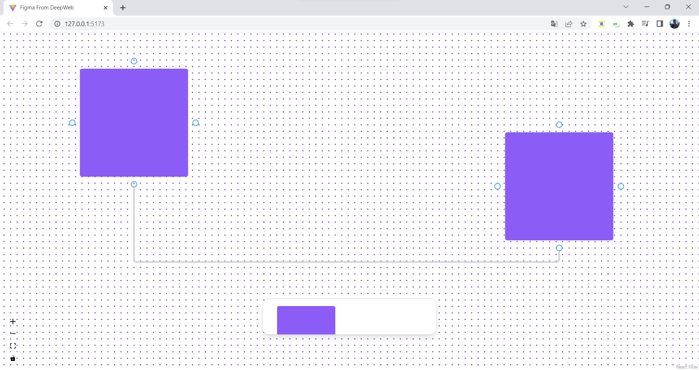

# FIGMA DA DEEPWEB :computer:

## Introdução :

Este "projeto" foi originado do vídeo Rocketseat "<a href="https://www.youtube.com/watch?v=J3vbTM21uDs">Criando seu próprio app de whiteboard com React (UI do Figma Jam)</a>". Neste vídeo, o instrutor e CTO Diego Fernandes tem como objetivo orientar a criação de um quadro branco usando o reactflow LIB. O React Flow é uma biblioteca de código aberto altamente personalizável e licenciada pelo MIT para criar editores baseados em nós e diagramas interativos.


## Descrição:

O projeto foi batizado por Figma de DeepWeb e visa reproduzir os resultados de estudos relacionados ao LIB já apresentado. Para não torná-lo algo mais complexo, os quadrados foram introduzidos como objetos principais e as linhas que os conectam foram remodeladas.

O ReactFlow trabalha com dois componentes principais, nós e arestas. Os nós são todos os componentes com os quais o usuário pode interagir e editar, enquanto as arestas são as linhas que conectam os outros componentes.


Como já mencionado, o principal componente para criar toda a dinâmica do quadro branco foi um quadrado simples, que está no arquivo Square.tsx. Este arquivo retorna um div que modela o corpo do quadrado e contém suas propriedades. As propriedades são retiradas de NodeProps, isso se deve ao uso de TypeScript. Para construir os pontos de conexão foi necessário adicionar um tag Handle ao componente, que permite criar as famosas bolas de conexão entre os componentes. Eles possuem algumas propriedades, as utilizadas neste estudo foram position (Permite determinar em qual posição este ponto deve estar), type (Determina se este ponto deve ser o gerador da conexão ou receptáculo) e id (Para diferenciá-lo do outras).

```markdown

<!-- Exemplo 1: Handle -->

<Handle 
    id="right" 
    type="source" 
    position={Position.Right}
    className="-right-5 w-3 h-3 border-2 bg-transparent border-blue-400"
/>
<Handle 
    id="left" 
    type="source" 
    position={Position.Left} 
    className="-left-5 w-3 h-3 border-2 bg-transparent border-blue-400"/>
<Handle 
    id="top" 
    type="source" 
    position={Position.Top}
    className="-top-5 w-3 h-3 border-2 bg-transparent border-blue-400"
/>
<Handle 
    id="bottom" 
    type="source" 
    position={Position.Bottom}
    className="-bottom-5 w-3 h-3 border-2 bg-transparent border-blue-400"
/>
```

Para adicionar a funcionalidade de redimensionamento, a tag NodeResizer foi atribuída ao div principal do quadrado. Esta tag permite ao usuário modificar livremente as dimensões do quadrado quando o mouse estiver nas bordas do componente. Para que esta funcionalidade esteja operacional, é necessário definir algumas propriedades:

* minHeight e minWidth: determinam o tamanho mínimo/inicial que o componente deve ter.

* isVisible: Prop que determina se o redimensionamento pode ou não ser executado.

* lineClassName e handleClassName: Estes são os props que adicionam classes às linhas que circundam o bloco ao redimensionar e redimensionar bolas, respectivamente.

```markdown

<!-- Exemplo 2: NodeResizer -->

<NodeResizer 
    minHeight={200}
    minWidth={200}
    isVisible={selected}
    lineClassName="border-blue-400"
    handleClassName="h-3 w-3 bg-white border-2 rounded border-blue-400"
/>
```

O ReactFlow já disponibiliza por padrão algumas setas para as conexões, porém, dá liberdade para o desenvolvedor criar as suas próprias, claro respeitando as limitações da LIB. Devido às propriedades das conexões, elas não podem ser criadas usando tags html padrão, portanto, devem ser modeladas usando svg. Na documentação do ReactFlow é possível encontrar os modelos de linha que podem ser utilizados na construção de uma linha customizada.

```markdown

<!-- Exemplo 3: EdgePath -->

<path
    id={id}
    style={style}
    className="react-flow__edge-path stroke-[3] stroke-zinc-300"
    d={edgePath}
    markerEnd={markerEnd}
/>

```

Neste projeto, o modelo de linha getSmoothStepPath foi selecionado devido ao seu efeito de deixar as curvas das linhas com arestas mais agradáveis. Este modelo de código funciona como uma função onde as props de posição inicial e final devem ser passadas, retornando assim o formato linha/conexão. Depois de receber o formato e os dados, a linha é atribuída na etiqueta de caminho.



O código responsável por redefinir o quadro branco está no arquivo App.tsx junto com as configurações de pré-seta.

```markdown
<div className="w-screen h-screen">
    <ReactFlow 
        nodeTypes={NODE_TYPES}
        edgeTypes={EDGES_TYPES}
        nodes={nodes}
        edges={edges}
        onNodesChange={onNodesChange}
        onConnect={onConnect}
        connectionMode={ConnectionMode.Loose}
        defaultEdgeOptions={{
            type: "default"
        }}
    >
        <Background
            gap={12}
            size={2}
            color="#4C1D95"
        />
        <Controls />
    </ReactFlow>
    <Toolbar.Root 
        className="fixed bottom-20 left-1/2 -translate-x-1/2 bg-white rounded-2xl shadow-lg border border-zinc-300 px-8 h-20 w-96 overflow-hidden"
    >
        <Toolbar.Button 
            className="w-32 h-32 bg-violet-500 mt-6 rounded transition-transform hover:-translate-y-2"
            onClick={addSquareNode}
        />
    </Toolbar.Root>
</div>
```

Na tag ReactFlow é o local onde faz configurações das setas/edges, dos componentes/nodes e as demais configurações. O quadro branco é modelado pela tag Background, nela é capaz de fazer modificações de espaçamento entre as bolinhas, cores e etc (Tudo registrado na documentação do ReactFlow).

A tag Controls introduz controles de navegação no quadro branco.